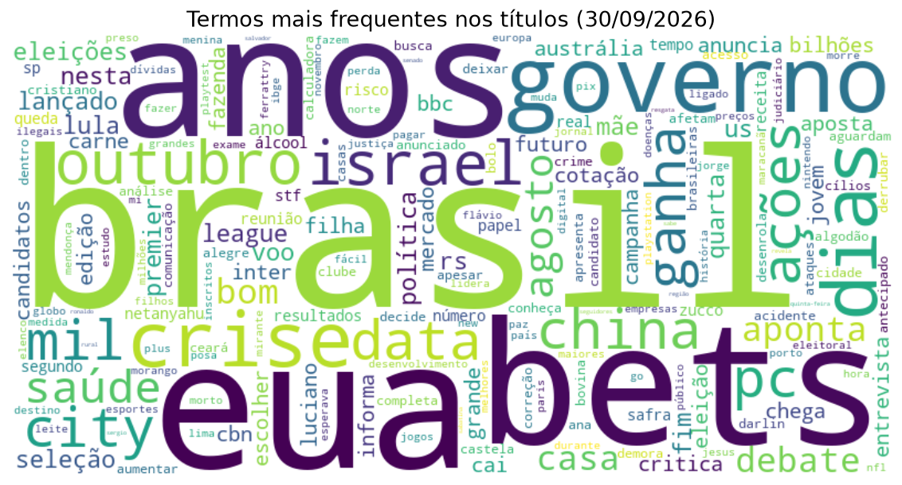

# BigData News Analysis

Análise de títulos de notícias usando Python, PySpark e visualizações.

[](https://colab.research.google.com/github/Davi7071/BigData-News-Analysis/blob/main/bigdata.ipynb)

## Descrição

Este projeto coleta automaticamente títulos de artigos de vários portais de notícias brasileiros, processa-os com PySpark (limpeza, remoção de stopwords, contagem de palavras e bigramas) e gera visualizações dos termos mais frequentes. Os títulos brutos são salvos em CSV e o ranking de termos em JSON, para integração com outras ferramentas ou dashboards.



## Funcionalidades

- **Validação de sites**: verifica em paralelo se cada portal está acessível; só os válidos são raspados.
- **Coleta de dados**: raspagem de até _N_ títulos por site com `newspaper4k`, com data de publicação, remoção de sufixos repetidos com o nome do site ("… – Pizza Fria"), deduplicação por URL e por texto e filtro opcional por período (`--dias`).
- **Processamento distribuído (Spark)**: remoção de URLs, pontuação, números e emojis com `regexp_replace`; tokenização (`RegexTokenizer`); stopwords do NLTK (português + inglês) + lista personalizada (`StopWordsRemover`); bigramas (`NGram`); contagem com `groupBy`.
- **Exportação**: CSV com os títulos brutos e JSON com os termos e bigramas mais frequentes.
- **Visualizações**: nuvem de palavras e gráficos de barras (top 10 palavras e top 10 bigramas), todos gerados a partir da mesma contagem do Spark.

## Estrutura

```
├── bigdata.ipynb       # notebook que executa o pipeline passo a passo
├── news_analysis.py    # código do pipeline (também executável via linha de comando)
├── requirements.txt
└── docs/               # imagens de exemplo
```

## Uso

### Google Colab

Abra o notebook pelo botão **Open in Colab** acima e execute as células em ordem. A primeira célula clona o repositório, instala as dependências e monta o Google Drive. Os resultados são salvos em `/content/drive/MyDrive/bigdata-news/`.

### Localmente

Requer Python 3.10+ e Java 17+ (necessário para o PySpark).

```bash
pip install -r requirements.txt
python news_analysis.py --max-artigos 30 --dias 7 --saida output
```

Opções:

| Opção | Padrão | Descrição |
|---|---|---|
| `--max-artigos` | 30 | títulos coletados por site |
| `--dias` | — | descarta artigos publicados há mais de N dias (artigos sem data são mantidos) |
| `--saida` | `output` | pasta onde os arquivos são salvos |
| `--top` | 20 | quantidade de termos nos arquivos JSON |
| `-v` | — | log detalhado |

Também é possível abrir `bigdata.ipynb` no Jupyter; nesse caso os resultados vão para `output/`.

### Arquivos gerados

| Arquivo | Conteúdo |
|---|---|
| `titulos_AAAAMMDD_HHMM.csv` | título, URL, site, data de publicação e data da coleta |
| `resultado.json` | top _N_ palavras e suas contagens |
| `bigramas.json` | top _N_ bigramas e suas contagens |
| `nuvem.png`, `top10_palavras.png`, `top10_bigramas.png` | visualizações |

## Configuração

- **Sites**: edite `NEWS_SITES` em `news_analysis.py` (ou a variável `sites` no notebook).
- **Stopwords**: `STOPWORDS_GRAMATICAIS` contém palavras sem valor informativo; `STOPWORDS_EDITORIAIS` contém termos com significado que foram removidos por aparecerem muito em chamadas ("vídeo", "veja", "ataque"...). Revise esta segunda lista conforme o objetivo da análise.

## Pipeline de Processamento

1. **Extração**: verificação dos sites e raspagem dos títulos com `newspaper.build()`; deduplicação e filtro por data.
2. **Transformação**: minúsculas, remoção de URLs/pontuação/números, tokenização e remoção de stopwords no Spark.
3. **Contagem**: contagem distribuída de palavras e bigramas no Spark.
4. **Carregamento**: exportação para CSV/JSON e geração dos gráficos.

---

## English Version

# BigData News Analysis

News headline analysis using Python, PySpark, and visualizations.

## Description

This project automatically collects article headlines from several Brazilian news websites, processes them with PySpark (cleaning, stopword removal, word and bigram counting), and generates visualizations of the most frequent terms. Raw headlines are saved as CSV and the term ranking as JSON, for integration with other tools or dashboards.

## Features

- **Site validation**: checks in parallel whether each website is reachable; only valid ones are scraped.
- **Data collection**: scrapes up to _N_ headlines per site with `newspaper4k`, including publish date, removal of repeated site-name suffixes, deduplication by URL and by text, and an optional time window (`--dias`).
- **Distributed processing (Spark)**: removes URLs, punctuation, numbers, and emojis with `regexp_replace`; tokenization (`RegexTokenizer`); NLTK (Portuguese + English) + custom stopwords (`StopWordsRemover`); bigrams (`NGram`); counting with `groupBy`.
- **Export**: CSV with raw headlines and JSON with the most frequent terms and bigrams.
- **Visualizations**: word cloud and bar charts (top 10 words and top 10 bigrams), all built from the same Spark count.

## Usage

- **Google Colab**: open the notebook with the **Open in Colab** button and run the cells in order. Results are saved to `/content/drive/MyDrive/bigdata-news/`.
- **Locally** (Python 3.10+ and Java 17+):

  ```bash
  pip install -r requirements.txt
  python news_analysis.py --max-artigos 30 --dias 7 --saida output
  ```

See the tables above for command-line options and generated files. Websites are configured in `NEWS_SITES` and stopwords in `STOPWORDS_GRAMATICAIS` / `STOPWORDS_EDITORIAIS` in `news_analysis.py`.

## Processing Pipeline

1. **Extraction**: site validation and headline scraping with `newspaper.build()`; deduplication and date filter.
2. **Transformation**: lowercasing, URL/punctuation/number removal, tokenization, and stopword removal in Spark.
3. **Counting**: distributed word and bigram counts in Spark.
4. **Loading**: export to CSV/JSON and chart generation.
